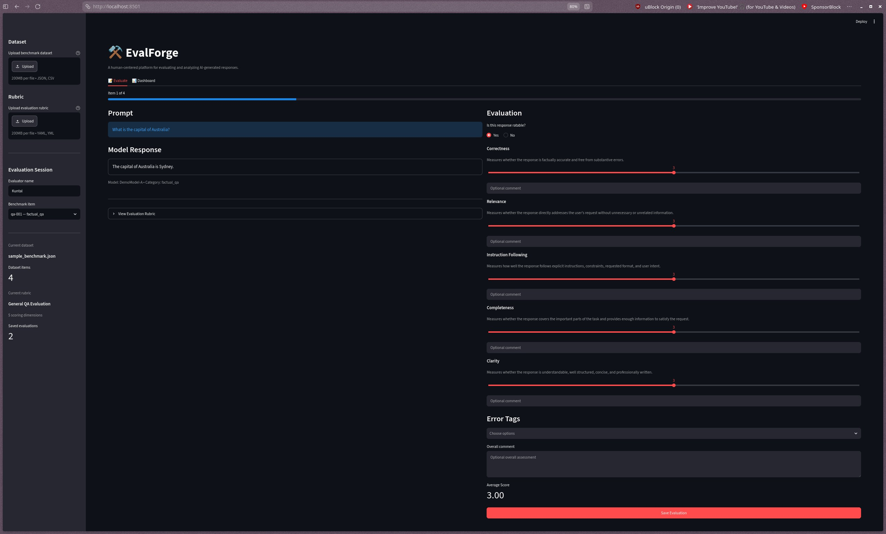
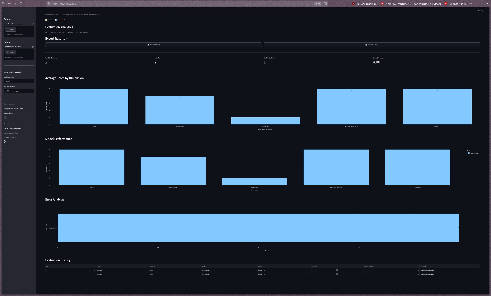

# ⚒️ EvalForge

**EvalForge** is a human-centered evaluation platform for systematically reviewing, scoring, and analyzing AI-generated responses.

🌐 **Live Demo:** https://evalforge-9cb65yb69rzuy6pjwdkdn2.streamlit.app/

It provides a reusable workflow for evaluating LLM outputs across configurable quality dimensions, identifying common failure modes, comparing model performance, and exporting structured evaluation results.

The project was built to explore practical problems in **LLM evaluation, AI quality assurance, human feedback, and model benchmarking**.

---

## Screenshots

### Evaluation Interface

EvalForge provides a structured interface for reviewing prompts and model responses using configurable scoring dimensions.



### Analytics Dashboard

Evaluation results are aggregated into model-comparison, dimension-level, and error-analysis views.



---

## Features

### Human Evaluation

Evaluate AI-generated responses using structured, multi-dimensional scoring rubrics.

Each evaluation supports:

- Ratability checks
- Dimension-level scoring
- Optional evaluator comments
- Error classification
- Overall assessment
- Persistent evaluation storage

---

### Custom Evaluation Rubrics

EvalForge is not tied to a single scoring framework.

Rubrics are defined using YAML and can be uploaded directly through the interface.

Example dimensions include:

- Correctness
- Relevance
- Instruction Following
- Completeness
- Clarity

The repository also includes a dedicated coding-response rubric with:

- Technical Correctness
- Instruction Following
- Code Quality
- Completeness
- Explanation Quality
- Robustness

---

### Dataset Upload

Benchmark datasets can be uploaded as:

- JSON
- CSV

Required fields:

```text
id
prompt
response
```

Optional fields:

```text
model_name
category
```

Example JSON:

```json
[
  {
    "id": "qa-001",
    "prompt": "What is the capital of Australia?",
    "response": "The capital of Australia is Sydney.",
    "model_name": "DemoModel-A",
    "category": "factual_qa"
  }
]
```

Example CSV:

```csv
id,prompt,response,model_name,category
qa-001,"What is the capital of Australia?","The capital of Australia is Sydney.","DemoModel-A","factual_qa"
```

---

## Custom Rubric Format

Rubrics are defined using YAML.

Example:

```yaml
name: General QA Evaluation

description: >
  A general-purpose rubric for evaluating the quality
  of AI-generated responses.

dimensions:
  - name: Correctness
    description: >
      Measures whether the response is factually accurate
      and free from substantive errors.
    min_score: 1
    max_score: 5

  - name: Relevance
    description: >
      Measures whether the response directly addresses
      the user's request.
    min_score: 1
    max_score: 5
```

EvalForge dynamically generates the scoring interface from the uploaded rubric.

---

## Error Taxonomy

Evaluators can classify observed response failures using tags such as:

- Factual Error
- Hallucination
- Incomplete Answer
- Instruction Violation
- Irrelevant Content
- Reasoning Error
- Formatting Issue
- Unclear Writing

These errors are automatically aggregated in the analytics dashboard.

---

## Analytics Dashboard

EvalForge converts human evaluations into structured analytics.

The dashboard includes:

- Total evaluation count
- Ratable response count
- Number of evaluated models
- Overall average score
- Average score by evaluation dimension
- Model-level performance comparison
- Error-type frequency analysis
- Evaluation history

This makes it possible to identify both model strengths and recurring failure patterns.

---

## Dataset and Rubric Isolation

Evaluation sessions are isolated by their dataset and rubric configuration.

This prevents results from unrelated benchmarking experiments from being mixed together.

For example:

```text
Dataset A + General QA Rubric
        ↓
Evaluation History A

Dataset A + Coding Rubric
        ↓
Evaluation History B

Dataset B + General QA Rubric
        ↓
Evaluation History C
```

Each combination maintains its own analytics and evaluation records.

---

## Export

Evaluation results can be downloaded directly from the dashboard as:

- CSV
- JSON

CSV exports flatten rubric dimensions into analysis-friendly columns, while JSON preserves the complete evaluation structure.

---

## Architecture

```text
evalforge/
│
├── app.py
│
├── evalforge/
│   ├── __init__.py
│   ├── analytics.py
│   ├── dataset.py
│   ├── evaluator.py
│   ├── export.py
│   ├── models.py
│   ├── rubric.py
│   └── storage.py
│
├── datasets/
│   ├── sample_benchmark.json
│   └── sample_benchmark.csv
│
├── rubrics/
│   ├── general_qa.yaml
│   └── coding.yaml
│
├── tests/
│   ├── test_dataset.py
│   ├── test_evaluator.py
│   └── test_storage.py
│
├── docs/
│   └── images/
│       ├── evalforge-evaluator.jpeg
│       └── evalforge-dashboard.jpeg
│
├── pytest.ini
├── requirements.txt
├── .gitignore
└── README.md
```

---

## Tech Stack

**Python**  
Core application and evaluation logic.

**Streamlit**  
Interactive human-evaluation interface and dashboard.

**Pydantic**  
Validation and structured data models.

**Pandas**  
Dataset processing, analytics, and exports.

**Plotly**  
Interactive evaluation visualizations.

**SQLite**  
Persistent local evaluation storage.

**PyYAML**  
Configurable evaluation rubrics.

**Pytest**  
Automated backend testing.

---

## Installation

Clone the repository:

```bash
git clone <repository-url>
cd evalforge
```

Create a virtual environment:

```bash
python3 -m venv .venv
```

Activate it on Linux/macOS:

```bash
source .venv/bin/activate
```

Install dependencies:

```bash
pip install -r requirements.txt
```

---

## Running EvalForge

Start the application:

```bash
streamlit run app.py
```

Then open:

```text
http://localhost:8501
```

in your browser.

---

## Running Tests

Run the complete test suite:

```bash
pytest -v
```

The current test suite covers:

- Evaluation scoring
- Ratability handling
- Rubric validation
- Missing evaluation dimensions
- Unknown evaluation dimensions
- JSON dataset loading
- CSV dataset loading
- Invalid dataset handling
- SQLite persistence
- Dataset isolation

Current status:

```text
14 passed
```

---

## Evaluation Workflow

```text
Benchmark Dataset
       │
       ▼
Prompt + Model Response
       │
       ▼
Is the response ratable?
       │
   ┌───┴───┐
   │       │
  No      Yes
   │       │
Reason     ▼
       Rubric Scoring
            │
            ▼
       Error Tagging
            │
            ▼
       Save Evaluation
            │
            ▼
     Analytics Dashboard
            │
            ▼
       CSV / JSON Export
```

---

## Motivation

Evaluating language models is more complex than deciding whether an answer simply looks good.

Useful evaluation systems need to consider multiple quality dimensions, identify ambiguous or unratable examples, classify failure modes, maintain consistent scoring criteria, and aggregate results across many examples and models.

EvalForge explores how these evaluation workflows can be implemented as a reusable software platform.

The project focuses on practical concepts used in areas such as:

- LLM evaluation
- AI quality assurance
- Human feedback pipelines
- Model benchmarking
- Error analysis
- AI data quality

---

## Future Work

Potential extensions include:

- LLM-as-a-Judge evaluation
- Human vs automated evaluator agreement analysis
- Cohen's Kappa and inter-rater reliability metrics
- Multiple human evaluators per response
- Pairwise model comparison
- Evaluation assignment workflows
- Additional benchmark templates
- FastAPI backend
- Hosted deployment
- Authentication and multi-user evaluation sessions

---

## Disclaimer

The evaluation frameworks and sample datasets in this repository were created specifically for this project.

They do not reproduce proprietary evaluation guidelines, private benchmark datasets, or confidential annotation material from third-party platforms.

---

## Author

**Kuntal Dive**

Master's student in Digital Engineering at Bauhaus-Universität Weimar.

Interested in:

- Artificial Intelligence
- LLM Evaluation
- Machine Learning
- AI Quality
- Software Engineering
- Data Analysis
